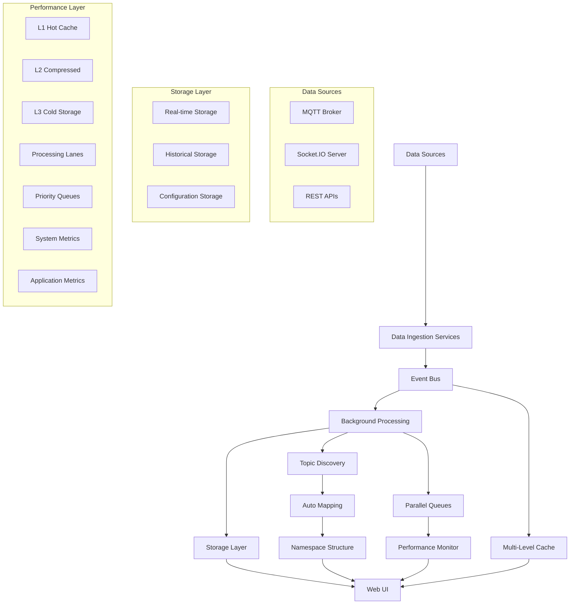
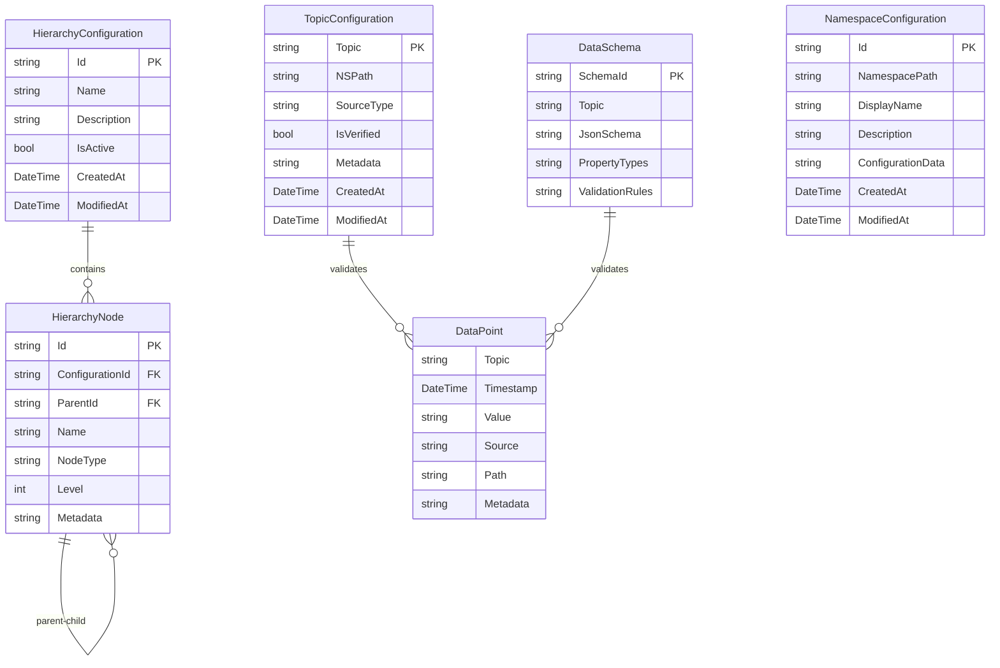

# UNSInfra - Unified Namespace Infrastructure


A comprehensive Unified Namespace (UNS) Infrastructure system for manufacturing and industrial IoT data management. Implements ISA-S95 hierarchical data structures with support for Sparkplug B protocol over MQTT, providing unified data ingestion, processing, and visualization across manufacturing systems.

## 🚀 Quick Start

### Prerequisites
- .NET 8.0 SDK or later
- Docker (optional, for containerized deployment)
- MQTT Broker (optional, for production MQTT connectivity)

### Running with Docker

```bash
# Clone the repository
git clone <repository-url>
cd UNSInfra

# Build and run with Docker Compose
docker compose up --build

# Or run individual services
docker build -t unsinfra-ui .
docker run -p 5000:8080 unsinfra-ui
```

### Building from Source

```bash
# Restore dependencies
dotnet restore UNSInfra.sln

# Build the solution
dotnet build UNSInfra.sln

# Run the UI application
dotnet run --project src/UNSInfra.UI

# Run example application
dotnet run --project src/UNSInfra.Examples
```

### Running Tests

```bash
# Run all tests
dotnet test UNSInfra.sln

# Run with coverage
dotnet test UNSInfra.sln --collect:"XPlat Code Coverage"

# Run specific test project
dotnet test src/UNSInfra.Core.Tests/UNSInfra.Core.Tests.csproj
dotnet test src/UNSInfra.Services.V1.Tests/UNSInfra.Services.V1.Tests.csproj
```

## 📋 Features Overview

| Feature | Description | Unit Tests | Integration Tests | Location |
|---------|-------------|------------|-------------------|----------|
| **Hierarchical Path Management** | ISA-S95 compliant hierarchical data structures | ✅ | ✅ | `UNSInfra.Core.Tests/Models/Hierarchy/` |
| **MQTT Data Ingestion** | Production MQTT client with SSL/TLS support | ✅ | ⚠️ | `UNSInfra.Services.V1.Tests/Mqtt/` |
| **Sparkplug B Protocol** | Complete Sparkplug B message decoding | ✅ | ⚠️ | `UNSInfra.Services.V1.Tests/SparkplugB/` |
| **Socket.IO Data Ingestion** | Real-time Socket.IO client integration | ⚠️ | ❌ | `UNSInfra.Services.SocketIO/` |
| **Auto Topic Mapping** | Intelligent topic-to-namespace mapping with persistence | ✅ | ✅ | `UNSInfra.Core.Tests/Services/AutoMapping/` |
| **High-Performance Caching** | Multi-level caching with L1/L2/L3 tiers and warming | ✅ | ⚠️ | `UNSInfra.Core/Services/Caching/` |
| **Parallel Processing** | High-throughput parallel queue processing | ✅ | ⚠️ | `UNSInfra.Core/Services/Processing/` |
| **Performance Monitoring** | Comprehensive system and application metrics | ✅ | ⚠️ | `UNSInfra.Core/Services/Monitoring/` |
| **Schema Validation** | JSON schema validation for data quality | ✅ | ⚠️ | `UNSInfra.Core/Validation/` |
| **Real-time Storage** | In-memory and persistent storage options | ✅ | ✅ | `UNSInfra.Storage.InMemory/`, `UNSInfra.Storage.SQLite/` |
| **Historical Data** | Time-series data storage and querying | ✅ | ✅ | `UNSInfra.Storage.SQLite/` |
| **Web UI** | Modern responsive Blazor Server interface | ❌ | ❌ | `UNSInfra.UI/` |
| **Log Viewer** | Real-time log viewing with search | ❌ | ❌ | `UNSInfra.UI/Components/Pages/LogViewer.razor` |
| **Configuration Management** | Dynamic service configuration with UI forms | ⚠️ | ❌ | `UNSInfra.Core/Configuration/` |
| **Event-Driven Architecture** | Pub/sub messaging with background services | ✅ | ⚠️ | `UNSInfra.Core.Tests/Services/Events/` |

**Legend:**
- ✅ Complete coverage
- ⚠️ Partial coverage or needs improvement
- ❌ No coverage yet

## 🆕 Recent Improvements (Latest Release)

### Performance Optimizations
- **Multi-Level Caching System**: Implemented L1 (hot), L2 (compressed), and L3 (cold storage) caching with automatic cache warming strategies for optimal performance
- **Parallel Queue Processing**: Added high-throughput parallel processing with multiple lanes, priority queues, and adaptive load balancing
- **Performance Monitoring**: Comprehensive system and application metrics collection with alerting and trend analysis

### Auto-Mapping Enhancements
- **Persistence Fix**: Auto-mapped topics now persist across application restarts via database storage
- **Improved Algorithm**: Enhanced auto-mapping to handle both full topic paths and namespace-like structures
- **Event-Driven Updates**: Real-time cache updates ensure immediate UI reflection of auto-mapping changes

### UI/UX Improvements
- **SocketIO Configuration**: Fixed dictionary field display in connection configuration forms with user-friendly key=value format
- **Data Availability**: Resolved "no data available" issues in UNS tree and data browser
- **Real-time Updates**: Enhanced topic discovery and display with proper event handling

### System Reliability
- **Event-Driven Architecture**: Improved event bus system with better subscription management
- **Error Handling**: Enhanced error logging and recovery mechanisms
- **Data Storage Pipeline**: Fixed missing data storage component in event processing chain

## 🏗️ Architecture Overview

### Core Components



### Project Structure

```
UNSInfra/
├── src/
│   ├── UNSInfra.Core/                    # Core models, interfaces, services
│   │   ├── Models/
│   │   │   ├── Hierarchy/                # ISA-S95 hierarchical structures
│   │   │   ├── Data/                     # Data point and schema models
│   │   │   └── Namespace/                # Namespace configuration
│   │   ├── Services/
│   │   │   ├── DataIngestion/            # Data ingestion abstractions
│   │   │   ├── TopicBrowser/             # Topic discovery and management
│   │   │   ├── AutoMapping/              # Auto topic-to-namespace mapping
│   │   │   ├── Caching/                  # Multi-level caching system
│   │   │   ├── Processing/               # Parallel queue processing
│   │   │   ├── Monitoring/               # Performance monitoring
│   │   │   └── Events/                   # Event-driven messaging
│   │   ├── Validation/                   # Schema validation framework
│   │   └── Repositories/                 # Data access abstractions
│   │
│   ├── UNSInfra.Services.V1/             # Production MQTT services
│   │   ├── Mqtt/                         # MQTT client implementation
│   │   ├── SparkplugB/                   # Sparkplug B protocol support
│   │   └── Configuration/                # MQTT/TLS configuration
│   │
│   ├── UNSInfra.Services.SocketIO/       # Socket.IO services
│   │   ├── SocketIODataService.cs        # Socket.IO client
│   │   └── Descriptors/                  # Service descriptors
│   │
│   ├── UNSInfra.Storage.InMemory/        # In-memory storage
│   │   ├── InMemoryRealtimeStorage.cs
│   │   └── InMemoryHistoricalStorage.cs
│   │
│   ├── UNSInfra.Storage.SQLite/          # SQLite persistence
│   │   ├── Entities/                     # EF Core entities
│   │   ├── Repositories/                 # Data access implementations
│   │   └── Storage/                      # Storage implementations
│   │
│   ├── UNSInfra.UI/                      # Blazor Server Web UI
│   │   ├── Components/
│   │   │   ├── Pages/                    # Razor pages
│   │   │   └── Layout/                   # Layout components
│   │   └── Services/                     # UI-specific services
│   │
│   ├── UNSInfra.Examples/                # Example applications
│   └── UNSInfra.Core.Tests/              # Unit tests
│       UNSInfra.Services.V1.Tests/       # MQTT/Sparkplug tests
│
├── compose.yaml                          # Docker Compose configuration
├── Dockerfile                            # Docker build configuration
└── README.md                             # This file
```

## 🗄️ Repository Entity Relationship



## 🛠️ Configuration

### MQTT Configuration

```json
{
  "MqttConfiguration": {
    "BrokerHost": "localhost",
    "BrokerPort": 1883,
    "UseTls": false,
    "ClientId": "UNSInfra-Client",
    "Username": null,
    "Password": null,
    "KeepAliveInterval": 60,
    "ConnectionTimeout": 30,
    "AutoReconnect": true,
    "TlsConfiguration": {
      "ClientCertificatePath": null,
      "CaCertificatePath": null,
      "AllowUntrustedCertificates": false
    }
  }
}
```

### Socket.IO Configuration

```json
{
  "SocketIOConfiguration": {
    "ServerUrl": "http://localhost:3000",
    "AutoConnect": true,
    "ReconnectAttempts": 5,
    "ReconnectDelay": 1000,
    "Events": ["data", "sensor_update", "telemetry"]
  }
}
```

### Storage Configuration

```json
{
  "StorageConfiguration": {
    "RealtimeStorage": "InMemory",
    "HistoricalStorage": "SQLite",
    "ConnectionString": "Data Source=unsinfra.db",
    "RetentionPeriod": "30.00:00:00"
  }
}
```

## 📊 Test Coverage Overview

### Current Test Statistics

| Project | Test Count | Pass Rate | Coverage |
|---------|------------|-----------|----------|
| UNSInfra.Core.Tests | 42 tests | 100% | ~85% |
| UNSInfra.Services.V1.Tests | 66 tests | 71% | ~60% |
| **Total** | **108 tests** | **82%** | **~75%** |

### Coverage by Component

- **Hierarchical Path System**: 95% coverage
- **Auto Topic Mapper**: 90% coverage  
- **Event System**: 85% coverage
- **MQTT Services**: 60% coverage (needs improvement)
- **Sparkplug B Decoder**: 70% coverage
- **Schema Validation**: 80% coverage
- **Storage Implementations**: 75% coverage

### Areas Needing Test Coverage

1. **UI Components**: No automated tests yet
2. **Integration Tests**: Limited end-to-end testing
3. **Socket.IO Services**: Minimal unit tests
4. **Configuration Management**: Partial coverage
5. **Background Services**: Needs more comprehensive testing

## 🚢 Docker Deployment

### Building Docker Image

```bash
# Build the UI application image
docker build -t unsinfra-ui -f Dockerfile .

# Build with specific platform
docker build --platform linux/amd64 -t unsinfra-ui .
```

### Docker Compose Deployment

```bash
# Start all services
docker compose up -d

# View logs
docker compose logs -f

# Scale services
docker compose up --scale unsinfra-ui=3 -d

# Stop services
docker compose down
```

### Docker Compose Services

The `compose.yaml` includes:
- **UNSInfra UI**: Blazor Server application
- **MQTT Broker**: Eclipse Mosquitto (optional)
- **Database**: SQLite (mounted volume)
- **Reverse Proxy**: Nginx (optional)

### Environment Variables

```bash
# Required
ASPNETCORE_ENVIRONMENT=Production
ASPNETCORE_URLS=http://+:8080

# Optional
ConnectionStrings__DefaultConnection=Data Source=/data/unsinfra.db
MqttConfiguration__BrokerHost=mqtt-broker
MqttConfiguration__BrokerPort=1883
```

## 🔧 Development Setup

### IDE Configuration

**Visual Studio / VS Code:**
```json
{
  "dotnet.defaultSolution": "UNSInfra.sln",
  "omnisharp.enableRoslynAnalyzers": true,
  "dotnet.completion.showCompletionItemsFromUnimportedNamespaces": true
}
```

**JetBrains Rider:**
- Enable nullable reference types warnings
- Configure code inspection profile for industrial IoT patterns
- Set up live templates for common UNS patterns

### Git Hooks

```bash
# Install pre-commit hooks
cp .githooks/pre-commit .git/hooks/
chmod +x .git/hooks/pre-commit
```

### Development Commands

```bash
# Watch mode for UI development
dotnet watch --project src/UNSInfra.UI

# Database migrations
dotnet ef migrations add <MigrationName> --project src/UNSInfra.Storage.SQLite

# Code formatting
dotnet format UNSInfra.sln

# Static analysis
dotnet build --verbosity normal --configuration Release
```

## 🤝 Contributing

1. Fork the repository
2. Create a feature branch: `git checkout -b feature/amazing-feature`
3. Make your changes and add tests
4. Ensure all tests pass: `dotnet test`
5. Run code formatting: `dotnet format`
6. Commit your changes: `git commit -m 'Add amazing feature'`
7. Push to the branch: `git push origin feature/amazing-feature`
8. Open a Pull Request

### Code Style Guidelines

- Use nullable reference types
- Follow async/await patterns consistently
- Implement proper error handling and logging
- Add XML documentation for public APIs
- Write unit tests for new functionality
- Follow ISA-S95 naming conventions for hierarchy

## 📚 Documentation

- [Architecture Guide](docs/architecture.md)
- [API Reference](docs/api-reference.md)
- [Deployment Guide](docs/deployment.md)
- [Configuration Reference](docs/configuration.md)
- [Troubleshooting](docs/troubleshooting.md)

## 🔧 Common Issues & Solutions

### Auto-Mapping Not Persisting
**Issue**: Topics auto-map correctly but disappear after restart.
**Solution**: Ensure `ITopicConfigurationRepository` is registered and database is accessible. Recent updates (v1.5) fixed this persistence issue.

### "No Data Available" in UNS Tree
**Issue**: Topics show up in data browser but not in UNS tree nodes.
**Solution**: Recent fixes ensure proper event handling between topic discovery and UI updates. Restart application to apply fixes.

### SocketIO Configuration Shows Dictionary Raw Type
**Issue**: Path Mappings field shows `System.Collections.Generic.Dictionary`...
**Solution**: Updated to v1.5 which provides user-friendly key=value format for dictionary fields.

### Performance Issues with Large Topic Volumes
**Issue**: System becomes slow with many topics.
**Solution**: Enable the new multi-level caching system (automatically enabled in v1.5+) and parallel processing queues.

## 🔗 Related Technologies

- **ISA-S95**: Manufacturing Operations Management standards
- **Sparkplug B**: MQTT-based IoT protocol specification
- **MQTT**: Lightweight messaging protocol for IoT
- **Blazor Server**: Server-side web UI framework
- **Entity Framework Core**: Object-relational mapping
- **SignalR**: Real-time web functionality

## 📄 License

This project is licensed under the MIT License - see the [LICENSE](LICENSE) file for details.

## 🙋‍♂️ Support

- Create an [Issue](https://github.com/your-org/UNSInfra/issues) for bug reports
- Start a [Discussion](https://github.com/your-org/UNSInfra/discussions) for questions
- Check the [Wiki](https://github.com/your-org/UNSInfra/wiki) for additional documentation

## 🎯 Roadmap

### Version 2.0
- [ ] GraphQL API support
- [ ] Time-series database integration (InfluxDB)
- [ ] Advanced analytics and dashboards
- [ ] Multi-tenant support
- [ ] Cloud deployment templates
- [ ] Machine learning-based anomaly detection

### Version 1.5 ✅ (Recently Completed)
- [x] **Performance optimization** - Multi-level caching, parallel processing
- [x] **Auto-mapping persistence** - Topic mappings survive restarts
- [x] **Enhanced UI forms** - Dictionary field support, better UX
- [x] **Data pipeline fixes** - Resolved "no data available" issues
- [x] **Performance monitoring** - Comprehensive metrics collection
- [ ] REST API endpoints
- [ ] Webhook support for external integrations
- [ ] Advanced schema validation rules
- [ ] Comprehensive integration tests

### Version 1.6 (Next Release)
- [ ] Real-time dashboards and visualizations
- [ ] Advanced alerting system with notification channels
- [ ] OPC UA protocol support
- [ ] Enhanced security with role-based access control
- [ ] Distributed deployment support

---

**Made with ❤️ for Industrial IoT and Manufacturing Systems**